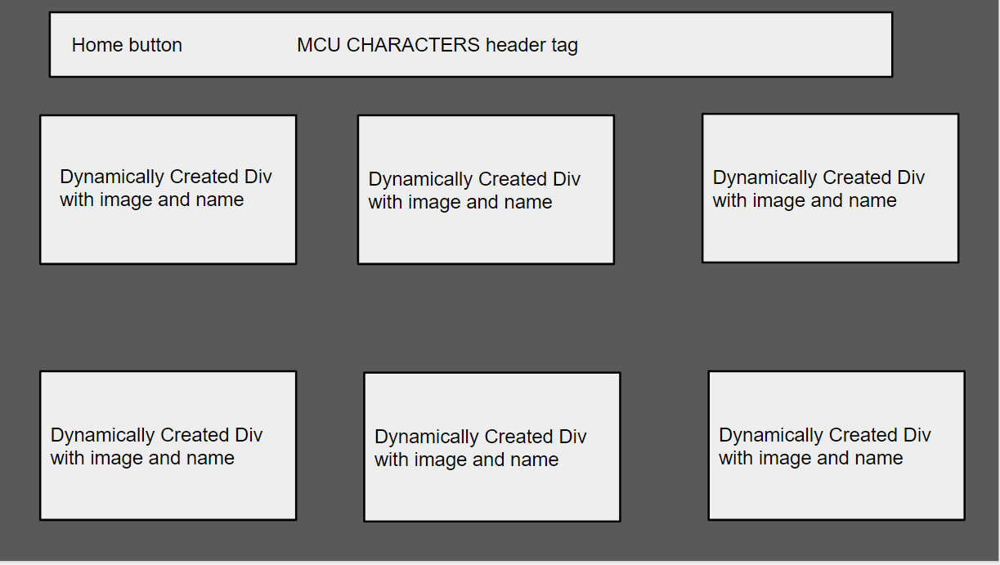
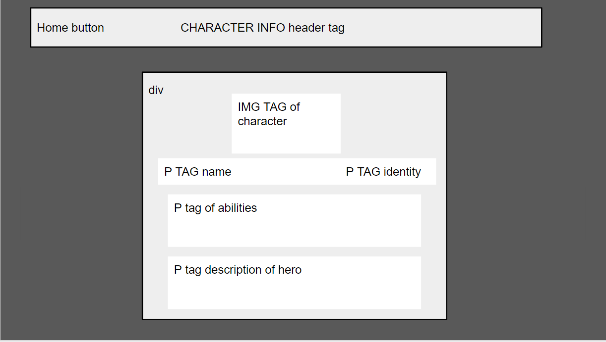

# MCU Character Database

​A web application that holds a library of MCU characters ranging from villains to heroes. Clicking on a character gives the user more info.
​

## Wireframe

​

## HTML elements (stuff present upon page load)

First PAGE

-   Menu Button: p tag/image, wrapped in an anchor tag
-   Header: h1/h2 tag with name of website
-   MCU Characters: dynamically created divs wrapped in anchor tags that contain an image (img) and name (p) of character

Second PAGE

-   Menu Button: p tag/image, wrapped in an anchor tag
-   Header: h1/h2 tag with page name
-   MCU Character: dynamically created div that contains the name (p) and identity (p) of the character, the abilities (p) that character has, an image (img) and a detailed description (p)

## State

​N/A

## Events (anything that happens via JS when the user interacts with your site)

-   Load
    -   fetch function for MCU character database is called
        -   client is created for supabase
        -   create a response variable that awaits all the variables in the table
        -   return the response data to the variable that called the fetch
    -   for loop goes through every piece of data in the characters variable
        -   character element is set to render function
        -   render function creates elements for specific image and name to display
        -   appends elements to a div
        -   returns div to the character element
        -   appends character element to the character list and repeat
-   Character Link

    -   second description page is loaded
    -   second page load event listener
        -   fetch function for finding a character by id is called
        -   create a response variable that awaits the table data matching the id of the character
        -   returns response data to the function call
        -   render function creates all of the elements in the data table

-   Home Button
    -   Returns user to first page with the characters loaded

## Functions

### Render Functions

-   renderCharacters function- creates elements and displays all of the characters in the database.
-   renderCharacterInfo function - creates elements and displays all of the info of a specific character by ID

### Display functions

-   displayCharacters function - for loop that calls the render Characters function and uses the returned data to append an element to the displayList div

### Fetch Functions

-   fetchCharacters function- grabs the data from supabase and returns all of the rows

-   fetchCharactersDescription - grabs and returns ALL of the data from ONE specific character by ID to display on the second page
    ​

## Slices​

1. Create second page files and write HTML to both pages
2. Mess with some CSS styling by hard coding some divs, delete after push
3. On load on the home page, see a list of characters, fetched from supabase
4. On clicking a character, user should be taken to that characters’s detail page.
5. Detail page should get the id from the URL and use that id to fetch that character from supabase.
6. Detail page should show the user details about the character with more details than on the list page
